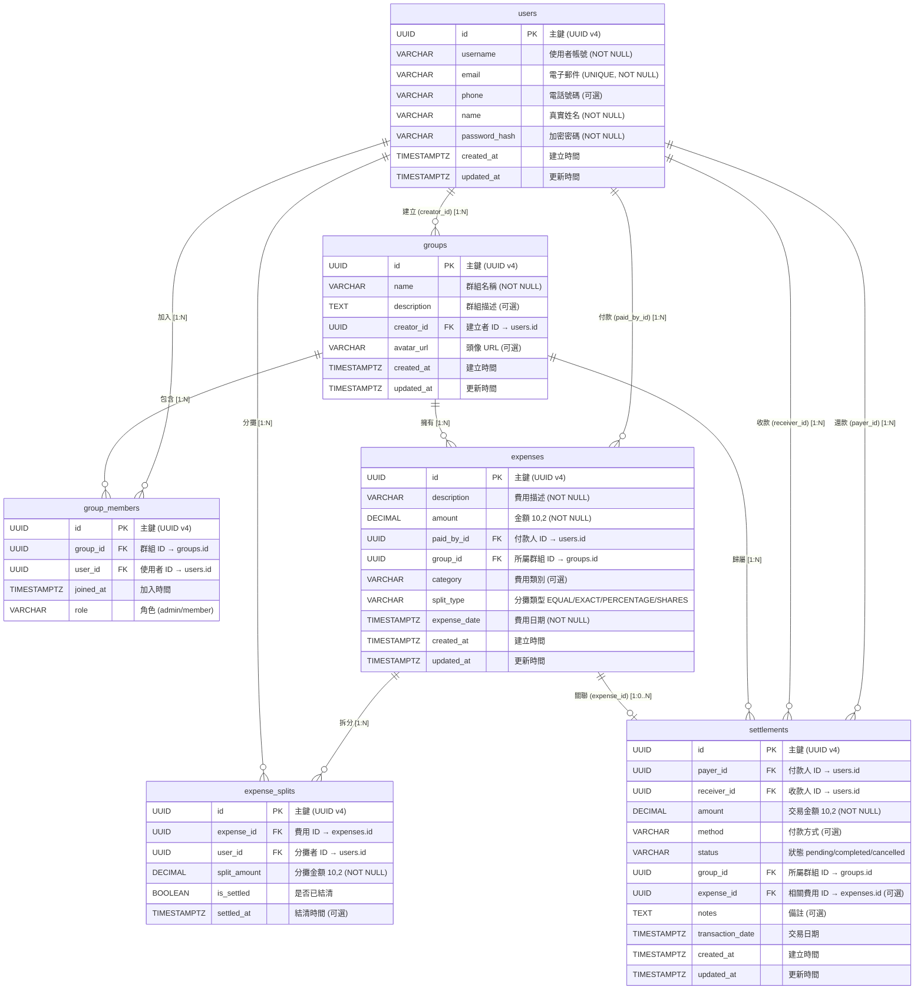

# 資料庫設計與正規化分析文件

> **專案名稱**：群組分帳系統 (Group Expense Splitting System)  
> **資料庫管理系統**：PostgreSQL  
> **ORM 框架**：SQLAlchemy 2.0  
> **文件版本**：v1.0  
> **最後更新日期**：2026-06-07

---

## 目錄

1. [系統資料庫架構概述](#1-系統資料庫架構概述)
2. [實體關聯圖 (ER Diagram)](#2-實體關聯圖-er-diagram)
3. [資料庫正規化分析 (1NF → 3NF)](#3-資料庫正規化分析-1nf--3nf)
4. [系統擴充性與未來保留欄位](#4-系統擴充性與未來保留欄位)

---

## 1. 系統資料庫架構概述

### 1.1 資料庫選型：PostgreSQL

本系統選用 **PostgreSQL** 作為關聯式資料庫管理系統（RDBMS），決策考量如下：

| 考量面向 | 決策理由 |
|---------|---------|
| **UUID 原生支援** | PostgreSQL 內建 `UUID` 資料型別與 `gen_random_uuid()` 函式，無需額外套件即可產生全域唯一識別碼，非常適合分散式系統與微服務架構的擴展需求。 |
| **精確數值運算** | `DECIMAL(10,2)` 型別可確保金額計算的精確性，避免浮點數（FLOAT/DOUBLE）在分帳結算時產生的進位誤差——這對金融相關應用至關重要。 |
| **參照完整性** | 支援完善的外部鍵（Foreign Key）約束與級聯操作（CASCADE / RESTRICT / SET NULL），確保跨表資料的一致性。 |
| **時區感知** | `TIMESTAMP WITH TIME ZONE` 型別內建時區處理能力，適合可能跨時區使用的群組協作場景。 |
| **開源生態** | PostgreSQL 為業界最成熟、社群最活躍的開源關聯式資料庫之一，部署成本低且文件豐富。 |

### 1.2 整體關聯架構設計理念

本系統採用 **正規化關聯式架構（Normalized Relational Schema）**，核心設計原則如下：

- **以使用者（User）與群組（Group）為雙核心錨點**：所有業務邏輯——費用產生（Expense）、分攤拆帳（ExpenseSplit）、結算還款（Settlement）——皆圍繞「誰付了錢？」與「在哪個群組？」兩條主軸展開。
- **中介表處理多對多關係**：`group_members` 與 `expense_splits` 作為關聯表（Junction Table），將 M:N 關係拆解為兩個 1:N 關係，確保符合第三正規化。
- **UUID 作為全域主鍵**：全部六張資料表均使用 `UUID v4` 作為主鍵，避免自增整數（Auto-increment ID）在分散式環境下的碰撞風險，同時防止客戶端可猜測的 ID 序列所帶來的安全風險。
- **金額一律使用 DECIMAL**：所有涉及貨幣的欄位（`amount`、`split_amount`）皆採用 `DECIMAL(10,2)`，杜絕浮點數運算誤差。
- **軟刪除與狀態機設計**：`settlements.status` 採用狀態字串（`pending` → `completed` / `cancelled`）而非硬刪除，保留完整的交易稽核軌跡。

### 1.3 資料表總覽

本系統共定義 **6 張資料表**，分類如下：

| 分類 | 資料表名稱 | 用途說明 |
|------|-----------|---------|
| 核心實體表 | `users` | 系統使用者帳戶資訊 |
| 核心實體表 | `groups` | 分帳群組基本資訊 |
| 關聯中介表 | `group_members` | 使用者 ↔ 群組的多對多關係（含角色） |
| 業務交易表 | `expenses` | 群組內的單筆費用記錄 |
| 業務明細表 | `expense_splits` | 每筆費用的分攤明細（誰該付多少） |
| 業務交易表 | `settlements` | 使用者之間的結算還款記錄 |

---

## 2. 實體關聯圖 (ER Diagram)

以下使用 Mermaid.js 繪製完整的實體關聯圖（Entity-Relationship Diagram）：



### 2.1 關聯線說明

| 編號 | 關係類型 | 參與實體 | 說明 |
|------|---------|---------|------|
| (1) | **1:N** | `users` → `groups` | 一位使用者可建立多個群組；每個群組只有一位建立者（`creator_id` FK）。`ondelete="RESTRICT"` 防止誤刪仍有群組的使用者。 |
| (2) | **M:N** | `users` ↔ `groups` | 透過 `group_members` 中介表實現多對多。`UniqueConstraint(group_id, user_id)` 確保同一使用者不會重複加入同一群組。 |
| (3) | **1:N** | `users` → `expenses` | 一位使用者（付款人）可支付多筆費用；每筆費用恰有一位付款人（`paid_by_id` FK）。 |
| (4) | **1:N** | `groups` → `expenses` | 一個群組可包含多筆費用；每筆費用必定歸屬於一個群組（`group_id` FK）。刪除群組時，關聯費用將級聯刪除（`CASCADE`）。 |
| (5) | **M:N** | `expenses` ↔ `users` | 透過 `expense_splits` 中介表實現多對多——一筆費用可由多人分攤，一人也可分攤多筆費用。`UniqueConstraint(expense_id, user_id)` 防止重複分攤。 |
| (6) | **1:N × 2** | `users` → `settlements` | `settlements` 表同時持有 `payer_id` 與 `receiver_id` 兩個指向 `users` 的 FK，分別代表「付款方」與「收款方」。 |
| (7) | **1:N** | `groups` → `settlements` | 一個群組可有多筆結算記錄；每筆結算必定歸屬於一個群組（`group_id` FK）。 |
| (8) | **1:0..N** | `expenses` → `settlements` | 每筆結算可選擇性地關聯到一筆費用（`expense_id` FK 可為 NULL）。當費用被刪除時，`ondelete="SET NULL"` 保留結算記錄但清除關聯。 |

---

## 3. 資料庫正規化分析 (1NF → 3NF)

正規化（Normalization）是關聯式資料庫設計的核心方法論。本章將以本系統的具體 Table 結構為例，逐步驗證我們如何達成第一至第三正規化（1NF → 3NF）。

### 3.1 第一正規化 (1NF)：確保欄位原子性

> **1NF 定義**：資料表中的每一個欄位值都必須是單元值（Atomic Value），不可再分割；且每一列必須是唯一的。

#### ✅ 證明 1：拆分分攤明細，拒絕 JSON 巢狀結構

在直覺的分帳系統設計中，開發者可能傾向於在 `expenses` 表中直接儲存一個 JSON 或 Array 型別的 `splits` 欄位，例如：

```json
// ❌ 違反 1NF 的反面教材（本系統未採用）
{
  "description": "週五聚餐",
  "amount": 1500.00,
  "splits": [
    {"user_id": "aaa", "amount": 500},
    {"user_id": "bbb", "amount": 500},
    {"user_id": "ccc", "amount": 500}
  ]
}
```

這種設計雖然看似方便，但實際上違反了 1NF——`splits` 欄位內部包含了可再分割的子元素（user_id、amount），導致：

- 無法對分攤金額建立資料庫層級的約束檢查
- 無法直接使用 SQL 查詢「某使用者總共需要付多少錢」
- 更新單筆分攤時必須整包 JSON 讀出、修改、再寫回

**本系統的正確做法**：將分攤資訊獨立拆分為 `expense_splits` 表（`app/models/expense.py`，第 92–153 行），使每一筆分攤記錄都是一個獨立的資料列：

```python
# ✅ 符合 1NF 的設計（摘錄自 app/models/expense.py）
class ExpenseSplit(Base):
    __tablename__ = "expense_splits"

    id = Column(UUID(as_uuid=True), primary_key=True, ...)
    expense_id = Column(UUID, ForeignKey("expenses.id", ...), nullable=False)
    user_id = Column(UUID, ForeignKey("users.id", ...), nullable=False)
    split_amount = Column(DECIMAL(10, 2), nullable=False)
    is_settled = Column(Boolean, default=False, nullable=False)
    settled_at = Column(DateTime(timezone=True))
```

每個欄位（`expense_id`、`user_id`、`split_amount`、`is_settled`）皆為不可再分割的原子值，完全符合 1NF 要求。

#### ✅ 證明 2：拒絕多值欄位

`users` 表中（`app/models/user.py`），我們將 `phone` 定義為單一 `VARCHAR(20)` 欄位，而非逗號分隔的多值字串（如 `"0912-345-678, 02-1234-5678"`），確保每個欄位只儲存一個值。同樣地，`groups.avatar_url` 僅儲存一個 URL 字串，而非多個圖片的陣列。

#### ✅ 證明 3：每一列具備唯一識別

所有六張表皆以 UUID 主鍵確保每一列的唯一性，並在必要的業務場景（`group_members` 的 `(group_id, user_id)`、`expense_splits` 的 `(expense_id, user_id)`）加上 `UniqueConstraint` 以確保業務邏輯上的列唯一性。

---

### 3.2 第二正規化 (2NF)：消除部分相依

> **2NF 定義**：在滿足 1NF 的前提下，所有非主鍵欄位必須「完全功能相依」（Full Functional Dependency）於主鍵的所有組成部分。亦即，不存在僅相依於「部分主鍵」的欄位。

#### ✅ 證明 1：UUID 單一主鍵消除複合主鍵議題

本系統全部六張表皆採用 **單一 UUID 主鍵**（Single-Column Primary Key），因此在結構上根本不存在「部分相依於複合主鍵」的問題。以 `expenses` 表為例（`app/models/expense.py`，第 38–80 行）：

```python
# ✅ 單一主鍵設計 — 所有非鍵欄位完全相依於 id（摘錄自 app/models/expense.py）
class Expense(Base):
    __tablename__ = "expenses"

    id = Column(UUID(as_uuid=True), primary_key=True, ...)   # PK
    description = Column(String(255), nullable=False)         # 完全相依於 id
    amount = Column(DECIMAL(10, 2), nullable=False)           # 完全相依於 id
    paid_by_id = Column(UUID, ForeignKey("users.id", ...))    # 完全相依於 id
    group_id = Column(UUID, ForeignKey("groups.id", ...))     # 完全相依於 id
    category = Column(String(50))                             # 完全相依於 id
    split_type = Column(String(20), ...)                      # 完全相依於 id
    expense_date = Column(DateTime(...), nullable=False)      # 完全相依於 id
    created_at = Column(DateTime(...), ...)                   # 完全相依於 id
    updated_at = Column(DateTime(...), ...)                   # 完全相依於 id
```

每一個非主鍵欄位（`description`、`amount`、`paid_by_id`、`group_id`、`category` 等）都由「整筆費用記錄」所決定，亦即完全相依於主鍵 `id`。

#### ✅ 證明 2：中介表的主鍵設計

即使是 `group_members` 與 `expense_splits` 這類中介表（Junction Table），我們仍然採用獨立的 UUID 主鍵，而非 `(group_id, user_id)` 或 `(expense_id, user_id)` 的複合主鍵。這樣的設計：

- **避免了 2NF 的部分相依風險**：若使用 `(expense_id, user_id)` 作為複合主鍵，則理論上 `is_settled` 可能被設計成只相依於 `user_id` 而非整個複合鍵，導致部分相依。採用獨立主鍵後，所有欄位完全相依於單一主鍵 `id`。
- **額外加上 UniqueConstraint**：在 `group_members`（`app/models/group.py`，第 120–122 行）與 `expense_splits`（`app/models/expense.py`，第 148–150 行）上加入 `UniqueConstraint`，兼顧了複合主鍵的業務唯一性約束與單一主鍵的設計靈活性。

```python
# ✅ 中介表設計 — 獨立 UUID PK + 業務唯一約束（摘錄自 app/models/expense.py 第 148-150 行）
__table_args__ = (
    UniqueConstraint("expense_id", "user_id", name="uq_expense_split"),
)
```

---

### 3.3 第三正規化 (3NF)：消除遞移相依

> **3NF 定義**：在滿足 2NF 的前提下，所有非主鍵欄位必須直接相依於主鍵，不得存在「非鍵欄位相依於另一個非鍵欄位」的遞移相依（Transitive Dependency）。

#### ✅ 證明 1：費用表僅儲存外部鍵，不重複儲存使用者屬性

這是本系統 3NF 設計中最關鍵的決策。在 `expenses` 表（`app/models/expense.py`，第 50–54 行）中，記錄付款人資訊時，我們**僅儲存 `paid_by_id`（指向 `users.id` 的外部鍵）**，而沒有重複儲存付款人的 `username`、`email` 或 `name`：

```python
# ✅ 符合 3NF：僅儲存 FK，不重複儲存使用者屬性（摘錄自 app/models/expense.py 第 50-54 行）
paid_by_id = Column(
    UUID(as_uuid=True),
    ForeignKey("users.id", ondelete="RESTRICT", onupdate="CASCADE"),
    nullable=False,
)
```

以下對比說明違反 3NF 的設計 vs. 本系統的正確設計：

| 設計方案 | `expenses` 欄位 | 問題 |
|---------|----------------|------|
| ❌ 違反 3NF | `paid_by_id`, `paid_by_username`, `paid_by_email` | 若使用者更換 email，必須同步更新所有 `expenses` 記錄中的 `paid_by_email`。出現資料異常（Update Anomaly）。 |
| ✅ 本系統設計 | `paid_by_id`（僅 FK） | 要取得付款人資訊，透過 `JOIN users ON expenses.paid_by_id = users.id` 即可即時取得最新資料，無冗餘、無異常。 |

同樣的設計原則也應用在：
- `expenses.group_id`：不重複儲存 `group_name`
- `group_members.user_id`：不重複儲存 `username`
- `settlements.payer_id` / `settlements.receiver_id`：不重複儲存付款人/收款人的個人資訊
- `settlements.expense_id`：不重複儲存費用描述

#### ✅ 證明 2：群組建立者資訊的處理

`groups` 表（`app/models/group.py`，第 43–47 行）僅儲存 `creator_id` 指向 `users.id`，而不儲存建立者的姓名或 email：

```python
# ✅ 符合 3NF：僅儲存建立者 FK（摘錄自 app/models/group.py 第 43-47 行）
creator_id = Column(
    UUID(as_uuid=True),
    ForeignKey("users.id", ondelete="RESTRICT", onupdate="CASCADE"),
    nullable=False,
)
```

`ondelete="RESTRICT"` 的設計進一步確保了參照完整性——若某使用者曾建立群組，則該使用者記錄不可被直接刪除，避免孤立的外部鍵（Dangling FK）。

#### ✅ 證明 3：結算表不重複費用欄位

`settlements` 表（`app/models/settlement.py`，第 73–76 行）對費用的關聯僅儲存 `expense_id` FK，且設為可選（nullable）：

```python
# ✅ 符合 3NF：關聯費用僅存 FK，且為可選（摘錄自 app/models/settlement.py 第 73-76 行）
expense_id = Column(
    UUID(as_uuid=True),
    ForeignKey("expenses.id", ondelete="SET NULL", onupdate="CASCADE"),
)
```

此設計的精妙之處在於：結算記錄不必然對應到某一筆特定費用（例如使用者之間的直接還款可能不屬於任何一筆 expense），因此 `expense_id` 設為可選。而 `ondelete="SET NULL"` 的設定確保了當費用被刪除時，相關的結算記錄不會憑空消失（僅清除關聯），保留了完整的金流稽核軌跡。

---

### 3.4 正規化總結

| 正規化層級 | 核心要求 | 本系統的對應設計 |
|-----------|---------|----------------|
| **1NF** | 欄位原子性 | 將分攤明細從 `expenses` 獨立為 `expense_splits` 表；拒絕 JSON/Array 欄位；每欄僅存單一值。 |
| **2NF** | 消除部分相依 | 全表採用單一 UUID 主鍵，所有非鍵欄位完全相依於主鍵；中介表以 UniqueConstraint 替代複合主鍵。 |
| **3NF** | 消除遞移相依 | 所有表僅儲存外部鍵（FK），需取得關聯資料時透過 JOIN 查詢，杜絕資料冗餘與更新異常。 |

本系統的六張表已完全符合 **第三正規化（3NF）** 的要求。我們並未進行 BCNF 或更高階正規化（4NF、5NF），原因在於本系統的業務邏輯並未涉及多值相依（Multi-Valued Dependency）或聯合相依（Join Dependency）的場景——過度正規化反而會導致不必要的表格拆分與查詢複雜度上升。在實務開發中，3NF 是效能與資料一致性之間的最佳平衡點。

---

## 4. 系統擴充性與未來保留欄位 (Future-proofing)

一個成熟的資料庫設計不應僅滿足當前的 MVP（Minimum Viable Product）需求，更應預留未來功能迭代的彈性空間。本系統在欄位設計上採取了「前瞻性預留」策略：在不下修資料表結構（無需 ALTER TABLE migration）的前提下，為後續版本的功能擴充預先鋪路。以下逐一分析各表的彈性設計：

---

### 4.1 `users` 表 — 使用者資料的時間軸與擴充基礎

| 欄位 | 型別 | MVP 使用 | 未來擴充場景 |
|------|------|---------|-------------|
| `created_at` | `TIMESTAMPTZ` | ✅ 使用中 | 支援「會員週年慶」行銷自動化、使用者生命週期分析（Cohort Analysis）。 |
| `updated_at` | `TIMESTAMPTZ` | ✅ 使用中 | 搭配觸發器（Trigger）自動維護，可用於偵測長期未活躍的休眠帳號。 |
| `phone` | `VARCHAR(20)` | ⬜ 選填 | 未來可整合簡訊通知（SMS Notification）、雙因子驗證（2FA）的身分確認通道。 |

**設計洞察**：`created_at` 與 `updated_at` 使用了 `server_default=text("CURRENT_TIMESTAMP")` 與 `onupdate=text("CURRENT_TIMESTAMP")`，將時間戳維護的責任下放至資料庫層級，避免了應用層的時間同步問題，也為未來的審計日誌（Audit Log）提供了可靠的時間基準。

---

### 4.2 `groups` 表 — 群組社交化潛力

| 欄位 | 型別 | MVP 使用 | 未來擴充場景 |
|------|------|---------|-------------|
| `description` | `TEXT` | ⬜ 選填 | 群組簡介頁面，支援 Markdown 格式的群組說明、規則公告。 |
| `avatar_url` | `VARCHAR(500)` | ⬜ 選填 | 群組頭像上傳（整合 S3/Cloud Storage），提升 UI 識別度與社交體驗。 |

**設計洞察**：`avatar_url` 採用 500 字元的長度預留，考量到現代雲端儲存服務（如 AWS S3 pre-signed URL）的 URL 長度可能超過傳統的 255 字元上限，此設計避免了未來因 URL 過長而需要 migration 的技術債。

---

### 4.3 `expenses` 表 — 費用分類與彈性分帳

| 欄位 | 型別 | MVP 使用 | 未來擴充場景 |
|------|------|---------|-------------|
| `category` | `VARCHAR(50)` | ⬜ 選填 | **智慧分類系統**：可定義枚舉類別（食物🍔、交通🚗、住宿🏨、娛樂🎮），支援篩選分析與視覺化圖表（圓餅圖、長條圖），實現「本月飲食支出佔比」等個人財務分析功能。 |
| `split_type` | `VARCHAR(20)` | ✅ 使用中 | **多樣化分攤模式**：目前的 `EQUAL`（均分）為 MVP 核心功能。已預留 `EXACT`（指定金額）、`PERCENTAGE`（百分比）、`SHARES`（份數）等枚舉值，可支援「室友依房間大小比例分攤租金」或「情侶依收入比例分攤旅費」等進階場景。 |

**設計洞察**：`split_type` 採用 `VARCHAR(20)` 而非 ENUM 型別，是一項刻意的工程取捨：在 SQLAlchemy 中，字串型別比資料庫原生的 ENUM 更易於在 migration 中新增枚舉值，且避免了 PostgreSQL ENUM 的 `ALTER TYPE ... ADD VALUE` 在交易區塊內的諸多限制。

---

### 4.4 `expense_splits` 表 — 分帳狀態追蹤

| 欄位 | 型別 | MVP 使用 | 未來擴充場景 |
|------|------|---------|-------------|
| `is_settled` | `BOOLEAN` | ✅ 使用中 | 作為連結 `expense_splits` 與 `settlements` 的橋樑，未來可實現「一鍵結清」——將所有 `is_settled = False` 的分攤一次批次轉為結算記錄。 |
| `settled_at` | `TIMESTAMPTZ` | ⬜ 選填 | 結清時間的審計軌跡，可支援「結清時效分析」（平均結清天數），作為群組活躍度的評量指標。 |

---

### 4.5 `settlements` 表 — 支付整合與備註系統

| 欄位 | 型別 | MVP 使用 | 未來擴充場景 |
|------|------|---------|-------------|
| `method` | `VARCHAR(50)` | ⬜ 選填 | **金流整合預留點**：可定義 `cash`（現金）、`bank_transfer`（銀行轉帳）、`line_pay`（LINE Pay）、`paypal` 等支付管道。未來整合第三方金流 API（如 Stripe Connect）時，此欄位可直接記錄實際的支付渠道。 |
| `status` | `VARCHAR(20)` | ✅ 使用中 | **狀態機擴充**：目前支援 `pending` → `completed` / `cancelled`。未來可擴充 `disputed`（爭議中）、`refunded`（已退款）等狀態，搭配 `updated_at` 時間戳實現完整的交易生命週期追蹤。 |
| `notes` | `TEXT` | ⬜ 選填 | 自由文字備註，使用 `TEXT` 型別（無長度限制）以支援長篇的交易說明、還款備註或爭議協商記錄。 |
| `expense_id` | `UUID` (nullable) | ⬜ 選填 | **雙向追溯**：當結算來自特定費用的分攤還款時，此 FK 可追溯回原始費用。若為非特定費用的直接轉帳（例如「上個月的總帳結清」），則保持 NULL。此設計同時支援「費用驅動」與「自由還款」兩種模式。 |

**設計洞察**：`settlements` 表的 `expense_id` FK 採用 `ondelete="SET NULL"`，而非 `CASCADE`，這是一項審慎的決策——即使原始費用記錄被刪除，結算付款記錄仍應保留作為財務稽核的法律證據。

---

### 4.6 `group_members` 表 — 角色權限體系

| 欄位 | 型別 | MVP 使用 | 未來擴充場景 |
|------|------|---------|-------------|
| `role` | `VARCHAR(20)` | ✅ 使用中 | **RBAC 權限控管基礎**：目前區分 `admin` 與 `member`。未來可擴充 `moderator`（版主）、`viewer`（唯讀觀察者）等角色，結合後端 Middleware 實現細粒度的 API 權限驗證。 |
| `joined_at` | `TIMESTAMPTZ` | ✅ 使用中 | 群組成長分析（成員加入趨勢圖）、活躍成員區間統計。 |

---

### 4.7 未來擴充路線圖

基於以上預留欄位，本系統的後續版本可實現以下進階功能，且**無需進行任何破壞性資料庫遷移**：

```
MVP (v1.0)                       v1.5                             v2.0
   │                                │                                │
   ├─ 均分費用 (EQUAL)              ├─ 非均分模式                     ├─ 第三方金流整合
   ├─ 基本還款追蹤                  │  (EXACT/PERCENTAGE/SHARES)      │  (Stripe/LINE Pay)
   └─ 群組角色 (admin/member)       ├─ 智慧分類與消費分析             ├─ 雙因子驗證 (2FA)
                                    │  (category 維度)               └─ 審計日誌 (Audit Log)
                                    ├─ 結清時效統計                   │
                                    └─ 群組社交化                     │
                                       (avatar/description)           │
```

所有 v1.5 與 v2.0 的功能擴充，皆可直接利用現有資料表結構中的預留欄位實現，無需 ALTER TABLE 或資料遷移。這正是「前瞻性資料庫設計」的核心價值：**以最少的結構變動，支撐最大的功能演進**。

---

## 附錄：資料表完整欄位對照表

### A.1 `users`（使用者）

| # | 欄位名稱 | 資料型別 | 約束 | 預設值 | 說明 |
|---|---------|---------|------|-------|------|
| 1 | `id` | `UUID` | **PK** | `gen_random_uuid()` | 使用者唯一識別碼 |
| 2 | `username` | `VARCHAR(50)` | NOT NULL | — | 使用者帳號 |
| 3 | `email` | `VARCHAR(255)` | UNIQUE, NOT NULL | — | 電子郵件地址 |
| 4 | `phone` | `VARCHAR(20)` | — | NULL | 電話號碼（選填） |
| 5 | `name` | `VARCHAR(100)` | NOT NULL | — | 真實姓名 |
| 6 | `password_hash` | `VARCHAR(255)` | NOT NULL | — | bcrypt 雜湊密碼 |
| 7 | `created_at` | `TIMESTAMPTZ` | NOT NULL | `CURRENT_TIMESTAMP` | 帳號建立時間 |
| 8 | `updated_at` | `TIMESTAMPTZ` | NOT NULL | `CURRENT_TIMESTAMP` | 最後更新時間 |

### A.2 `groups`（群組）

| # | 欄位名稱 | 資料型別 | 約束 | 預設值 | 說明 |
|---|---------|---------|------|-------|------|
| 1 | `id` | `UUID` | **PK** | `gen_random_uuid()` | 群組唯一識別碼 |
| 2 | `name` | `VARCHAR(100)` | NOT NULL | — | 群組名稱 |
| 3 | `description` | `TEXT` | — | NULL | 群組描述（選填） |
| 4 | `creator_id` | `UUID` | **FK** → `users.id`, NOT NULL | — | 建立者 ID |
| 5 | `avatar_url` | `VARCHAR(500)` | — | NULL | 群組頭像 URL（選填） |
| 6 | `created_at` | `TIMESTAMPTZ` | NOT NULL | `CURRENT_TIMESTAMP` | 群組建立時間 |
| 7 | `updated_at` | `TIMESTAMPTZ` | NOT NULL | `CURRENT_TIMESTAMP` | 最後更新時間 |

### A.3 `group_members`（群組成員）

| # | 欄位名稱 | 資料型別 | 約束 | 預設值 | 說明 |
|---|---------|---------|------|-------|------|
| 1 | `id` | `UUID` | **PK** | `gen_random_uuid()` | 成員記錄唯一識別碼 |
| 2 | `group_id` | `UUID` | **FK** → `groups.id`, NOT NULL | — | 群組 ID |
| 3 | `user_id` | `UUID` | **FK** → `users.id`, NOT NULL | — | 使用者 ID |
| 4 | `joined_at` | `TIMESTAMPTZ` | NOT NULL | `CURRENT_TIMESTAMP` | 加入時間 |
| 5 | `role` | `VARCHAR(20)` | NOT NULL | `'member'` | 角色（admin / member） |
| — | `(group_id, user_id)` | — | **UNIQUE** | — | 防止重複加入 |

### A.4 `expenses`（費用）

| # | 欄位名稱 | 資料型別 | 約束 | 預設值 | 說明 |
|---|---------|---------|------|-------|------|
| 1 | `id` | `UUID` | **PK** | `gen_random_uuid()` | 費用唯一識別碼 |
| 2 | `description` | `VARCHAR(255)` | NOT NULL | — | 費用描述 |
| 3 | `amount` | `DECIMAL(10,2)` | NOT NULL | — | 費用總金額 |
| 4 | `paid_by_id` | `UUID` | **FK** → `users.id`, NOT NULL | — | 付款人 ID |
| 5 | `group_id` | `UUID` | **FK** → `groups.id`, NOT NULL | — | 所屬群組 ID |
| 6 | `category` | `VARCHAR(50)` | — | NULL | 費用類別（選填） |
| 7 | `split_type` | `VARCHAR(20)` | NOT NULL | `'EQUAL'` | 分攤類型 |
| 8 | `expense_date` | `TIMESTAMPTZ` | NOT NULL | — | 費用發生日期 |
| 9 | `created_at` | `TIMESTAMPTZ` | NOT NULL | `CURRENT_TIMESTAMP` | 記錄建立時間 |
| 10 | `updated_at` | `TIMESTAMPTZ` | NOT NULL | `CURRENT_TIMESTAMP` | 最後更新時間 |

### A.5 `expense_splits`（費用分攤明細）

| # | 欄位名稱 | 資料型別 | 約束 | 預設值 | 說明 |
|---|---------|---------|------|-------|------|
| 1 | `id` | `UUID` | **PK** | `gen_random_uuid()` | 分攤記錄唯一識別碼 |
| 2 | `expense_id` | `UUID` | **FK** → `expenses.id`, NOT NULL | — | 費用 ID |
| 3 | `user_id` | `UUID` | **FK** → `users.id`, NOT NULL | — | 分攤使用者 ID |
| 4 | `split_amount` | `DECIMAL(10,2)` | NOT NULL | — | 分攤金額 |
| 5 | `is_settled` | `BOOLEAN` | NOT NULL | `false` | 是否已結清 |
| 6 | `settled_at` | `TIMESTAMPTZ` | — | NULL | 結清時間（選填） |
| — | `(expense_id, user_id)` | — | **UNIQUE** | — | 防止重複分攤 |

### A.6 `settlements`（結算交易）

| # | 欄位名稱 | 資料型別 | 約束 | 預設值 | 說明 |
|---|---------|---------|------|-------|------|
| 1 | `id` | `UUID` | **PK** | `gen_random_uuid()` | 結算唯一識別碼 |
| 2 | `payer_id` | `UUID` | **FK** → `users.id`, NOT NULL | — | 付款人 ID |
| 3 | `receiver_id` | `UUID` | **FK** → `users.id`, NOT NULL | — | 收款人 ID |
| 4 | `amount` | `DECIMAL(10,2)` | NOT NULL | — | 交易金額 |
| 5 | `method` | `VARCHAR(50)` | — | NULL | 付款方式（選填） |
| 6 | `status` | `VARCHAR(20)` | NOT NULL | `'pending'` | 交易狀態 |
| 7 | `group_id` | `UUID` | **FK** → `groups.id`, NOT NULL | — | 所屬群組 ID |
| 8 | `expense_id` | `UUID` | **FK** → `expenses.id`, NULL | NULL | 相關費用 ID（選填） |
| 9 | `notes` | `TEXT` | — | NULL | 備註（選填） |
| 10 | `transaction_date` | `TIMESTAMPTZ` | NOT NULL | `CURRENT_TIMESTAMP` | 交易日期 |
| 11 | `created_at` | `TIMESTAMPTZ` | NOT NULL | `CURRENT_TIMESTAMP` | 記錄建立時間 |
| 12 | `updated_at` | `TIMESTAMPTZ` | NOT NULL | `CURRENT_TIMESTAMP` | 最後更新時間 |

---

> **文件結語**：本資料庫設計以第三正規化（3NF）為基礎，採用 PostgreSQL 的進階特性（UUID 主鍵、DECIMAL 精確數值、時區感知時間戳），並在各表中預留了充分的擴充欄位。整體架構在資料一致性、查詢效能與未來可維護性之間取得了務實的平衡，適合作為群組分帳系統的長期資料基礎設施。
